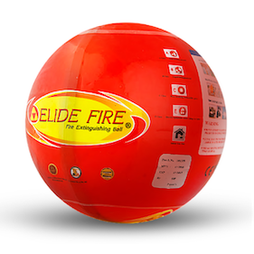
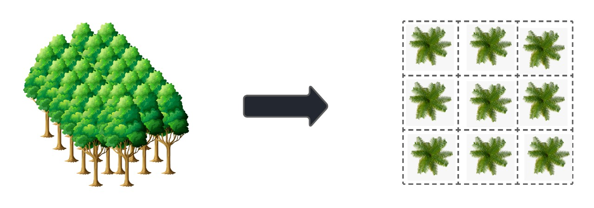
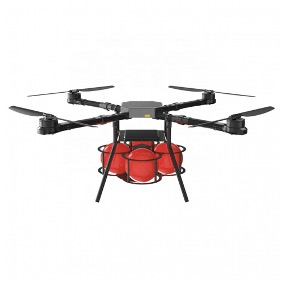

# Solution Identification

After healthy brainstorming on problem identification, our team visioned
to solve problems based on forest fire prevention, but considering the
potential challenges, our entire month was dedicated to researching
methodologies to mitigate forest fire with optimized solutions and
better management to reduce the damage caused by forest fires.

Our research is entirely focused on Live Detection, Prediction, and
Prevention because the proposed series will eradicate the loss caused by
a forest fire which can risk the lives of Flaura-fauna and human beings.

## Detection & Monitoring Forest-Fire

Talking about Detection, we want to focus on Live data instead of timed
data uploaded by various organizations.

A Dashboard displaying live forecasting of meteorological data using IoT
(Internet of Things) sensors will help the team to monitor the
geographical locations which can have potential risk to catch fire with
respect to either natural causes like weather conditions or man-made
causes like campfires.

We decided to connect IoT sensors that capture readings using Raspberry
Pi which is directly connected to Azure IoT central via Dashboard.

The dashboard provides the visualization of Live readings to the
concerned authority who is continuously monitoring the system and gives
the ability to analyze historical trends and visualize the data with
higher accessibility.

## Early Prediction

Considering the advantages provided by data for taking early steps
towards better management during a forest fire is a key component for
introducing Machine Learning Model towards early prediction.

Early Forest-Fire prediction model trained based on historical &
meteorological datasets will generate alerts and warnings to the
concerned authority to mitigate forest fire.

Furthermore, we identified the potential meteorological dataset which
may consider parameters like air temperature, humidity, soil moisture,
wind speed, geographical coordinates, etc.

We also identified the Machine Learning Algorithms like Support Vector
Machine, Decision Tree Classifier, Random Forest, etc. that can support
the proposed solutions with better accuracy when we start implementing
them.

Our main purpose to bring Machine Learning is to study the behavior of
historical forest-fire happened which will analyze the pattern of the
risk and potential fire-occurring hotspots.

## Prevention with ELIDE Fire

Through sensor readings and the help of the prediction model,
pinpointing the areas with the highest possibility of forest fire was
made possible. Once an area is marked as the beginning of a forest fire,
the deployment of ELIDE fire extinguisher balls on the marked area will
commence mitigating forest fire in its early stage.

To mitigate the forest fire in its early stage, the team agreed to the
idea of using a fire extinguisher ball. The reason why the team chose
the fire extinguisher ball over other ways is that the fire extinguisher
ball was found much safer, more effective, and quicker to deploy in case
of a forest fire. The specifications of the fire extinguisher ball, it
is a 6-inch ball and weighs 1.3 kilograms with a coverage of 1.80 cubic
meters (360°).

|
|:--:| 
| *ELIDE Fireball* |

For the deployment of the ELIDE fire extinguisher balls, the team has
formulated two separate ways. The first one is an on-the-ground approach
which uses the symmetrical approach where the fire extinguisher balls
are loaded in between matrixes and will cover its effect radius
symmetrically.

|
|:--:| 
| *Forest Trees Grid to deploy fireballs* |

The second approach is through a drone-aided system that will be
utilized for quick and safer mitigation of forest fire. A drone will be
deployed to drop an ELIDE fire extinguisher ball to the marked area.
Since the ELIDE fire extinguisher ball can cover 1.80 cubic meters,
preventing the progression of the forest fire will be more efficient and
cost-effective. For the number of fire extinguisher balls that a drone
can carry, a single drone can carry four (4) identical fire extinguisher
balls.  

| 
|:--:|:---:
| *Yaksha Drone* | *Yaksha Drone Solution*

In the next document, we shall focus on the various Solution implementations that we identified in this document.

[Solution Implementation](./Solution-Implementation.md)
